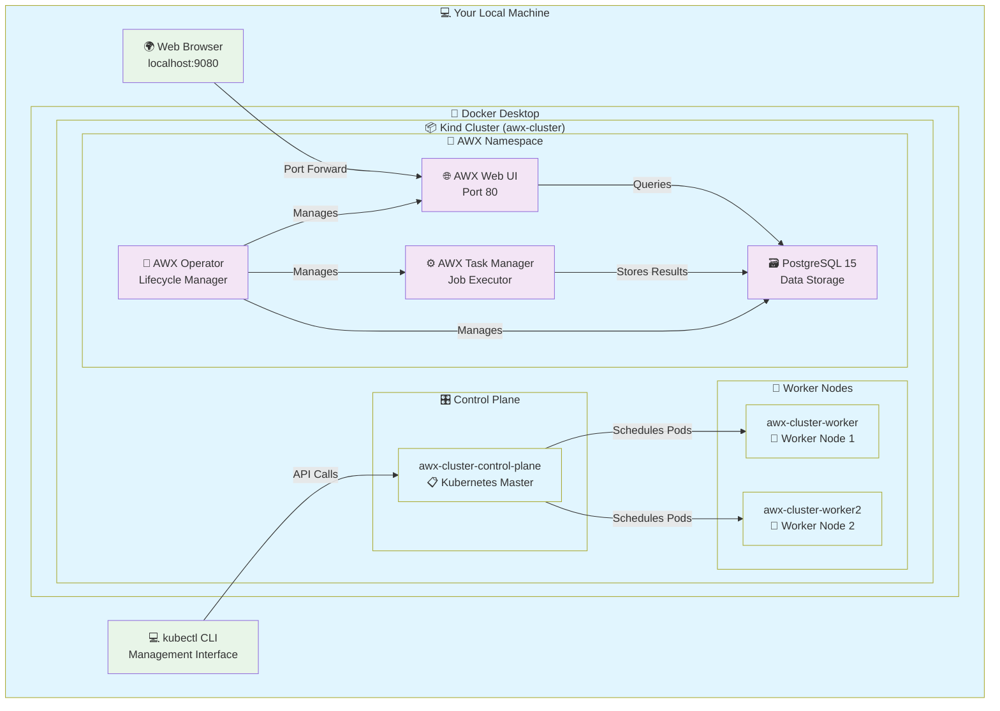
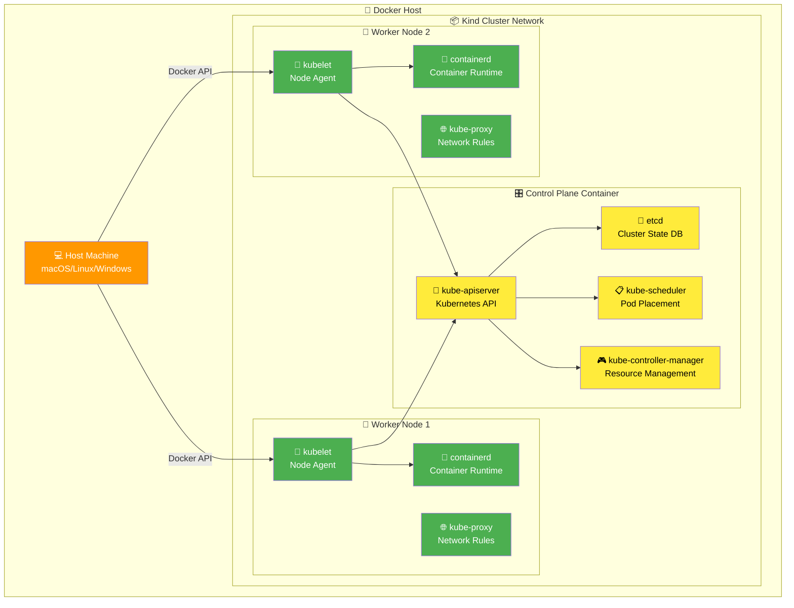
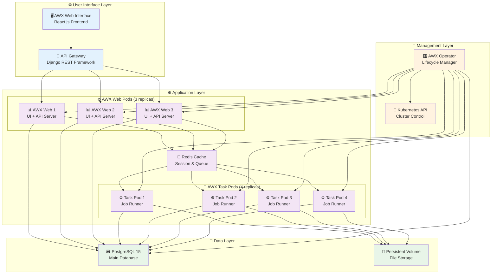
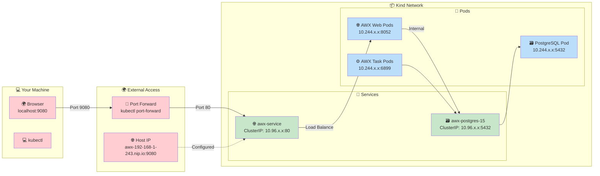
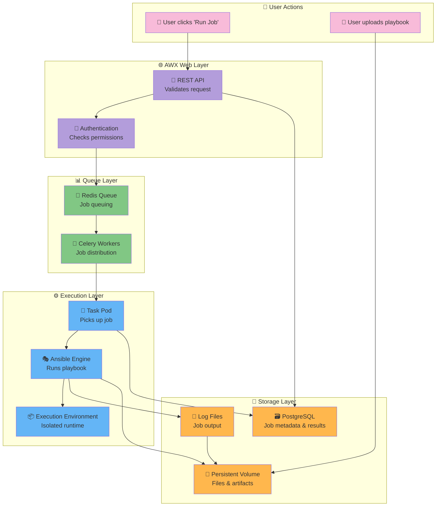
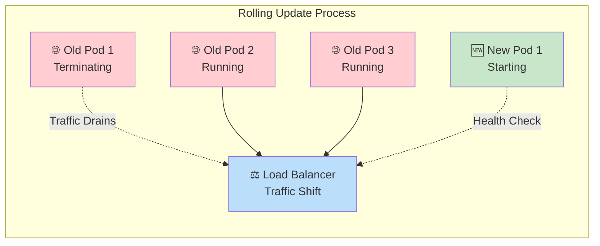
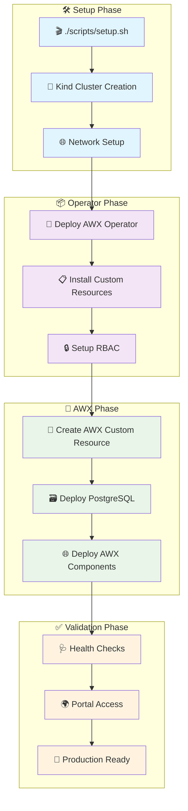
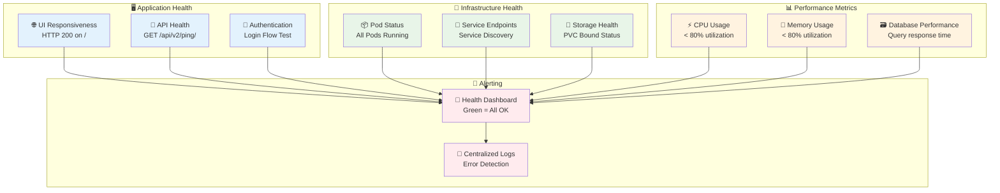
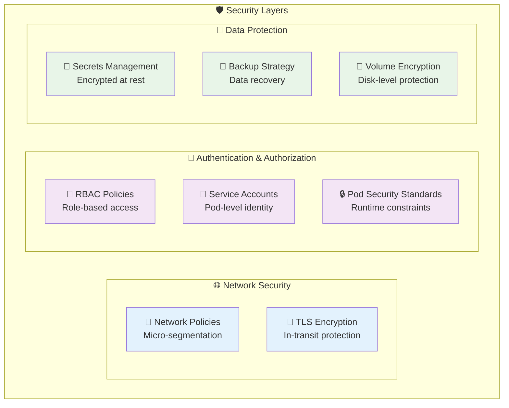

# 🏗️ AWX on Kind - Architecture Guide

> **For Freshers & Experts:** Complete architectural breakdown with interactive diagrams

This document explains the complete architecture of our AWX deployment on Kind Kubernetes, from high-level concepts to detailed pod interactions.

---

## 🎯 Quick Overview (For Freshers)

**What is this?** 
- AWX = Open-source automation platform (like Ansible Tower)
- Kind = Kubernetes running inside Docker containers
- This setup = AWX running on a local Kubernetes cluster for development/testing

**Why this architecture?**
- 🏠 **Local Development**: No cloud costs, full control
- 🔒 **Secure**: Runs entirely on your machine  
- 🔄 **Repeatable**: Infrastructure as code
- 🧪 **Learning**: Perfect for Kubernetes/AWX experimentation

---

## 🏢 High-Level Architecture



---

## 🔍 Detailed Component Architecture

### 1. 🏗️ Infrastructure Layer (Kind Cluster)



**🔍 For Freshers:**
- **Control Plane**: The "brain" that decides where to run your applications
- **Worker Nodes**: The "muscle" that actually runs your applications  
- **Kind Magic**: All of this runs inside Docker containers on your laptop!

---

### 2. 🎯 AWX Application Architecture



---

## 📋 Pod-by-Pod Breakdown

### 🌐 AWX Web Pods (3 replicas)

```yaml
Name: awx-web-6d47f48f48-xxxxx
Containers: 3/3 Running
```

**🎯 Purpose:** Serve the web interface and handle API requests

**📦 Containers:**
1. **🖥️ awx-web** - Main Django application
   - Serves React.js frontend
   - Handles REST API calls  
   - Manages user authentication
   - **Port**: 8052 (internal)

2. **🔄 redis** - Session & queue management
   - Stores user sessions
   - Queues automation jobs
   - **Port**: 6379 (internal)

3. **📊 awx-rsyslog** - Log collection
   - Collects application logs
   - Forwards to central logging
   - **Port**: 514 (internal)

**🔍 For Freshers:**
- Think of this as a "web server" that shows you the AWX interface in your browser
- 3 copies = if one crashes, the other 2 keep working (high availability)
- Like having 3 cashiers at a store - if one goes on break, customers still get served

**🧠 For Experts:**
- Horizontal Pod Autoscaler ready
- StatelessSet pattern for scalability
- Session affinity via Redis
- Health checks: `/api/v2/ping/`

### ⚙️ AWX Task Pods (4 replicas)

```yaml
Name: awx-task-6457867854-xxxxx  
Containers: 4/4 Running
```

**🎯 Purpose:** Execute automation jobs (Ansible playbooks)

**📦 Containers:**
1. **🤖 awx-task** - Job execution engine
   - Runs Ansible playbooks
   - Manages job queues
   - Handles inventory sync
   
2. **📊 awx-ee** - Execution Environment
   - Isolated job runtime
   - Contains Ansible collections
   - Security sandboxing

3. **📡 receptor** - Job distribution
   - Mesh networking for jobs
   - Multi-node job coordination
   - **Port**: 27199 (internal)

4. **📊 awx-rsyslog** - Log collection
   - Job output logging  
   - Real-time log streaming

**🔍 For Freshers:**
- These are the "workers" that actually run your automation scripts
- 4 copies = can run 4 different automation jobs at the same time
- Like having 4 robots in a factory, each can work on different tasks simultaneously

**🧠 For Experts:**
- Job isolation via execution environments
- Resource limits enforced per job
- Receptor mesh for distributed execution
- Job artifacts stored in persistent volume

### 🗃️ PostgreSQL Pod

```yaml
Name: awx-postgres-15-0
Containers: 1/1 Running
```

**🎯 Purpose:** Store all AWX data persistently

**📦 Container:**
- **🗃️ postgres** - PostgreSQL 15 database
  - Stores user accounts, projects, inventories
  - Job history and results
  - System configuration
  - **Port**: 5432 (internal)

**💾 Storage:**
- **PVC**: 8Gi persistent volume
- **Location**: `/var/lib/postgresql/data`
- **Survives**: Pod restarts, cluster restarts

**🔍 For Freshers:**
- This is like a "filing cabinet" that remembers everything
- All your automation projects, user accounts, and job history live here
- Even if you restart everything, your data is safe

**🧠 For Experts:**
- StatefulSet with persistent storage
- WAL logging enabled for durability  
- Backup hooks for data protection
- Connection pooling via pgbouncer

### 🤖 AWX Operator Pod

```yaml
Name: awx-operator-controller-manager-xxxxx
Containers: 2/2 Running  
```

**🎯 Purpose:** Manage AWX deployment lifecycle

**📦 Containers:**
1. **🎛️ manager** - Operator controller
   - Watches AWX custom resources
   - Manages deployments/scaling
   - Handles upgrades/rollbacks

2. **🔒 kube-rbac-proxy** - Security proxy
   - RBAC enforcement
   - Metrics endpoint protection
   - **Port**: 8443 (internal)

**🔍 For Freshers:**
- This is like a "supervisor" that makes sure AWX is always running properly
- If AWX breaks, the operator automatically fixes it
- Like having a maintenance person who constantly checks and repairs things

**🧠 For Experts:**
- Custom Resource Definition (CRD) based
- Reconciliation loop every 30 seconds
- Leader election for HA
- Prometheus metrics exposed

### 🔄 Migration Job (Completed)

```yaml
Name: awx-migration-24.6.1-9rmqd
Containers: 0/1 Completed
```

**🎯 Purpose:** One-time database schema setup

**📦 Process:**
- Runs during initial deployment
- Sets up database tables
- Migrates data from previous versions
- Self-terminates when complete

**🔍 For Freshers:**
- This is like "setting up the filing system" in your database
- Runs once when AWX first starts, then goes away
- Like assembly workers who build something once then move to the next project

---

## 🌐 Network Architecture



**🔍 Network Flow Explanation:**

1. **🌍 Browser Request**: You type `localhost:9080`
2. **🔌 Port Forward**: kubectl forwards traffic to cluster
3. **🚪 Service**: Kubernetes service receives traffic
4. **⚖️ Load Balancing**: Service picks one of 3 web pods
5. **🌐 Web Pod**: Processes request, queries database if needed
6. **🔄 Response**: Data flows back through same path

**🔒 Security Notes:**
- No direct host port exposure
- All traffic encrypted within cluster
- Service mesh ready architecture

---

## 💾 Data Flow & Storage



---

## 🔧 Operational Patterns

### 🔄 High Availability Pattern

**🎯 Zero Downtime Updates:**


### 📈 Auto-Scaling Pattern

**🎯 Horizontal Pod Autoscaling:**

```mermaid
graph TB
    METRICS[📊 Metrics Server<br/>CPU/Memory Usage]
    HPA[📈 Horizontal Pod Autoscaler<br/>Scale Decision]
    
    subgraph "Current State"
        POD1[🌐 Web Pod 1<br/>CPU: 80%]
        POD2[🌐 Web Pod 2<br/>CPU: 85%]
        POD3[🌐 Web Pod 3<br/>CPU: 90%]
    end
    
    subgraph "Scaled State"
        NPOD1[🌐 Web Pod 1<br/>CPU: 60%]
        NPOD2[🌐 Web Pod 2<br/>CPU: 55%]
        NPOD3[🌐 Web Pod 3<br/>CPU: 65%]
        NPOD4[🆕 Web Pod 4<br/>CPU: 50%]
        NPOD5[🆕 Web Pod 5<br/>CPU: 45%]
    end
    
    METRICS --> HPA
    HPA -.->|Scale Up Command| NPOD4
    HPA -.->|Scale Up Command| NPOD5
    
    classDef current fill:#ffcdd2
    classDef new fill:#c8e6c9
    classDef scaled fill:#bbdefb
    class POD1,POD2,POD3 current
    class NPOD4,NPOD5 new
    class NPOD1,NPOD2,NPOD3 scaled
```


---

## 🚀 Deployment Workflow



---

## 🎓 Learning Paths

### 👶 For Kubernetes Beginners

**📚 Start Here:**
1. **Understand Pods** → Look at `kubectl get pods -n awx`
2. **Understand Services** → See how traffic reaches pods
3. **Understand Volumes** → Where data is stored
4. **Understand Operators** → How AWX manages itself

**🛠️ Hands-on Learning:**
```bash
# See all the pieces
kubectl get all -n awx

# Watch pods in real-time  
kubectl get pods -n awx -w

# Check pod details
kubectl describe pod awx-web-xxx -n awx

# See pod logs
kubectl logs awx-web-xxx -n awx -c awx-web
```

### 🧠 For Kubernetes Experts

**🔍 Advanced Topics:**
- **Custom Resource Definitions**: How AWX extends Kubernetes
- **Operator Pattern**: Reconciliation loops and controllers
- **StatefulSets vs Deployments**: Why PostgreSQL uses StatefulSet
- **Network Policies**: Micro-segmentation opportunities
- **Resource Quotas**: Multi-tenant considerations
- **Pod Security Standards**: Security hardening approaches

**🔧 Advanced Operations:**
```bash
# Operator logs for troubleshooting
kubectl logs -n awx-operator-system deployment/awx-operator-controller-manager

# Check custom resource status
kubectl get awx awx -n awx -o yaml

# Monitor resource usage
kubectl top pods -n awx

# Network troubleshooting
kubectl exec -it awx-web-xxx -n awx -c awx-web -- netstat -tulpn
```

---

## 📊 Monitoring & Observability

### 🔍 Health Check Points



### 📈 Built-in Monitoring Commands

```bash
# 🎮 Interactive Menu System
./scripts/setup.sh  # → Option 5 (Status Dashboard)

# 🩺 Quick Health Check
kubectl get pods -n awx                    # Pod health
kubectl get svc -n awx                     # Service health  
kubectl get pvc -n awx                     # Storage health

# 📊 Resource Usage
kubectl top pods -n awx                    # CPU/Memory usage
kubectl describe nodes                     # Node capacity

# 🔍 Detailed Investigation
kubectl logs awx-web-xxx -n awx -c awx-web # Application logs
kubectl get events -n awx --sort-by='.lastTimestamp' # Recent events
```

---

## 🎯 Production Considerations

### 🔒 Security Hardening



### 📈 Scaling Strategies

**🔄 Horizontal Scaling:**
- Web pods: 3 → 5 → 10 (based on traffic)
- Task pods: 4 → 8 → 16 (based on job queue)
- Database: Read replicas for reporting

**⬆️ Vertical Scaling:**
- Increase CPU/memory per pod
- Scale underlying Kind cluster
- Optimize resource requests/limits

**🌍 Multi-Environment:**
- Development: Single-node Kind cluster
- Staging: Multi-node local cluster  
- Production: Cloud Kubernetes (EKS/GKE/AKS)

---

## 🎉 Summary

This AWX on Kind deployment provides:

**✅ For Learning:**
- Complete Kubernetes application stack
- Real-world operator pattern example
- Hands-on container orchestration
- Database integration patterns

**✅ For Development:**
- Local automation testing platform
- AWX feature development environment
- Ansible playbook prototyping
- CI/CD pipeline testing

**✅ For Production Readiness:**
- High availability patterns
- Monitoring and alerting foundation
- Security best practices
- Scaling strategies

**🚀 Next Steps:**
1. Explore the interactive menu: `./scripts/setup.sh`
2. Run your first automation job in AWX
3. Experiment with scaling: `kubectl scale deployment awx-web --replicas=5 -n awx`
4. Set up monitoring with Prometheus/Grafana
5. Implement backup strategies

---

**🎓 Remember:** This architecture serves as both a learning platform and a foundation for production deployments. Start simple, understand each component, then evolve based on your needs!
