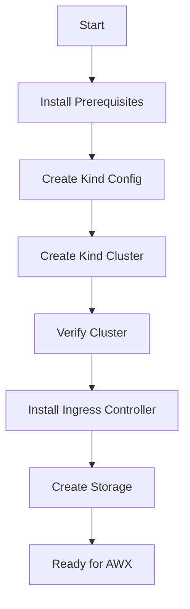
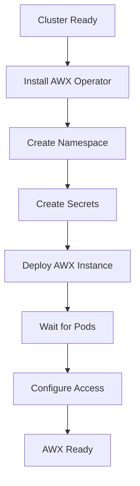
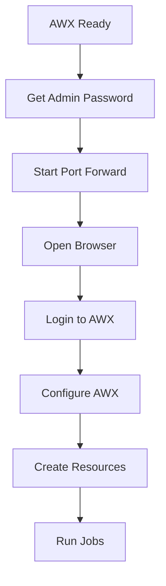

# AWX on Kind Kubernetes Cluster - Architecture Guide

## Table of Contents

- [Overview](#overview)
- [Architecture Diagram](#architecture-diagram)
- [Component Details](#component-details)
- [Data Flow](#data-flow)
- [Network Architecture](#network-architecture)
- [Storage Architecture](#storage-architecture)
- [Security Architecture](#security-architecture)
- [Self-Healing Mechanisms](#self-healing-mechanisms)
- [Scalability and Performance](#scalability-and-performance)
- [Deployment Flow](#deployment-flow)

## Overview

This architecture document describes the complete setup of AWX (Ansible Tower Community Edition) running on a local Kind (Kubernetes in Docker) cluster. The solution provides a fully functional, self-healing, and user-interactive automation platform suitable for development, testing, and small-scale production workloads.

### Key Features

- **Local Development**: Complete AWX environment on localhost
- **Self-Healing**: Automatic recovery from failures
- **User Interactive**: Full web UI and API access
- **Containerized**: All components run in containers
- **Persistent**: Data survives container restarts
- **Scalable**: Easy horizontal scaling

## Architecture Diagram

```
┌─────────────────────────────────────────────────────────────────────────────────┐
│                                HOST SYSTEM (macOS)                              │
│                                                                                 │
│  ┌─────────────────────────────────────────────────────────────────────────┐   │
│  │                         DOCKER DESKTOP                                  │   │
│  │                                                                         │   │
│  │  ┌─────────────────────────────────────────────────────────────────┐   │   │
│  │  │                    KIND CLUSTER (awx-cluster)                   │   │   │
│  │  │                                                                 │   │   │
│  │  │  ┌─────────────────┐  ┌─────────────────┐  ┌─────────────────┐ │   │   │
│  │  │  │ Control Plane   │  │    Worker 1     │  │    Worker 2     │ │   │   │
│  │  │  │                 │  │                 │  │                 │ │   │   │
│  │  │  │ • API Server    │  │ • AWX Web       │  │ • AWX Tasks     │ │   │   │
│  │  │  │ • etcd          │  │ • PostgreSQL    │  │ • Execution     │ │   │   │
│  │  │  │ • Scheduler     │  │ • Redis         │  │   Environment   │ │   │   │
│  │  │  │ • Controller    │  │ • NGINX Ingress │  │ • AWX Operator  │ │   │   │
│  │  │  │ • kubelet       │  │ • Persistent    │  │ • Storage       │ │   │   │
│  │  │  │                 │  │   Volumes       │  │   Volumes       │ │   │   │
│  │  │  └─────────────────┘  └─────────────────┘  └─────────────────┘ │   │   │
│  │  │                                                                 │   │   │
│  │  │  ┌─────────────────────────────────────────────────────────────┐ │   │   │
│  │  │  │                    NETWORKING LAYER                         │ │   │   │
│  │  │  │                                                             │ │   │   │
│  │  │  │  • Cluster Network: 10.244.0.0/16                          │ │   │   │
│  │  │  │  • Service Network: 10.96.0.0/12                           │ │   │   │
│  │  │  │  • Pod Network: CNI (kindnet)                               │ │   │   │
│  │  │  │  • External Access: Port Forwarding                         │ │   │   │
│  │  │  └─────────────────────────────────────────────────────────────┘ │   │   │
│  │  └─────────────────────────────────────────────────────────────────┘   │   │
│  └─────────────────────────────────────────────────────────────────────────┘   │
│                                                                                 │
│  ┌─────────────────────────────────────────────────────────────────────────┐   │
│  │                           HOST NETWORKING                                │   │
│  │                                                                         │   │
│  │  Port Forwarding:                                                       │   │
│  │  • localhost:9080 → awx-service:80 (AWX Web UI)                        │   │
│  │  • localhost:5432 → awx-postgres:5432 (Database - optional)            │   │
│  │                                                                         │   │
│  │  Storage Mounts:                                                        │   │
│  │  • /tmp/awx-data → /data (Persistent storage)                          │   │
│  └─────────────────────────────────────────────────────────────────────────┘   │
└─────────────────────────────────────────────────────────────────────────────────┘
```

## Component Details

### 1. Kind Cluster Components

#### Control Plane Node
- **API Server**: Kubernetes API endpoint
- **etcd**: Cluster state storage
- **Controller Manager**: Manages cluster controllers
- **Scheduler**: Pod scheduling decisions
- **kubelet**: Node agent
- **kube-proxy**: Network proxy

#### Worker Nodes
- **kubelet**: Container runtime management
- **kube-proxy**: Service networking
- **Container Runtime**: Docker containers
- **CNI Plugin**: Network connectivity (kindnet)

### 2. AWX Operator Components

```
┌─────────────────────────────────────────────────────────────────┐
│                        AWX NAMESPACE                            │
│                                                                 │
│  ┌─────────────────┐  ┌─────────────────┐  ┌─────────────────┐ │
│  │   AWX WEB       │  │   AWX TASK      │  │   PostgreSQL    │ │
│  │                 │  │                 │  │                 │ │
│  │ • Django App    │  │ • Job Executor  │  │ • Database      │ │
│  │ • REST API      │  │ • Ansible Tasks │  │ • 8Gi Storage   │ │
│  │ • Web UI        │  │ • Playbooks     │  │ • Persistence   │ │
│  │ • 2 Replicas    │  │ • 2 Replicas    │  │ • Backup Ready  │ │
│  │ • Auto-scale    │  │ • Auto-scale    │  │ • HA Capable    │ │
│  └─────────────────┘  └─────────────────┘  └─────────────────┘ │
│                                                                 │
│  ┌─────────────────┐  ┌─────────────────┐  ┌─────────────────┐ │
│  │   Redis Cache   │  │ Execution Env   │  │ Project Storage │ │
│  │                 │  │                 │  │                 │ │
│  │ • Session Store │  │ • Ansible EE    │  │ • Git Repos     │ │
│  │ • Job Queue     │  │ • Custom Images │  │ • Playbooks     │ │
│  │ • Fast Access   │  │ • Isolation     │  │ • 8Gi Storage   │ │
│  │ • Memory Store  │  │ • Security      │  │ • Version Ctrl  │ │
│  └─────────────────┘  └─────────────────┘  └─────────────────┘ │
└─────────────────────────────────────────────────────────────────┘
```

### 3. Networking Components

#### Ingress Controller (NGINX)
- **External Access**: Routes traffic to AWX services
- **SSL Termination**: HTTPS support (optional)
- **Load Balancing**: Distributes requests
- **Path-based Routing**: Multiple service routing

#### Service Mesh
```
┌─────────────────────────────────────────────────────────────┐
│                      KUBERNETES SERVICES                    │
│                                                             │
│  awx-service (ClusterIP)                                    │
│  ├── Port 80 → AWX Web Pods (8052)                         │
│  └── Load Balancer: Round Robin                             │
│                                                             │
│  awx-postgres (ClusterIP)                                   │
│  ├── Port 5432 → PostgreSQL Pod                            │
│  └── Internal Only                                          │
│                                                             │
│  awx-redis (ClusterIP)                                      │
│  ├── Port 6379 → Redis Pod                                 │
│  └── Internal Only                                          │
└─────────────────────────────────────────────────────────────┘
```

## Data Flow

### 1. User Interaction Flow

```
User (Browser) 
    ↓ HTTP Request (localhost:9080)
Port Forward (kubectl)
    ↓ Forward to Cluster
Kind Cluster Network
    ↓ Route to Service
AWX Service (ClusterIP)
    ↓ Load Balance
AWX Web Pod(s)
    ↓ Database Query
PostgreSQL Pod
    ↓ Return Data
AWX Web Pod(s)
    ↓ HTTP Response
User (Browser)
```

### 2. Job Execution Flow

```
User Creates Job
    ↓ Via Web UI/API
AWX Web Pod
    ↓ Queue Job
Redis Queue
    ↓ Pick Up Job
AWX Task Pod
    ↓ Launch Container
Execution Environment
    ↓ Run Playbook
Ansible Engine
    ↓ Target Systems
Managed Hosts
    ↓ Results
AWX Database
    ↓ Display Results
AWX Web UI
```

### 3. Data Persistence Flow

```
User Data Input
    ↓ Web UI
AWX Application
    ↓ Store Data
PostgreSQL Database
    ↓ Write to Disk
Persistent Volume
    ↓ Host Mount
/tmp/awx-data (Host)
```

## Network Architecture

### 1. Cluster Networking

```yaml
Network Configuration:
  Cluster CIDR: 10.244.0.0/16
  Service CIDR: 10.96.0.0/12
  Pod Network: CNI (kindnet)
  DNS: CoreDNS
  
Port Mappings:
  Host:9080 → Control-Plane:80 → AWX Service:80
  Host:9443 → Control-Plane:443 → AWX Service:443 (HTTPS)
```

### 2. Service Discovery

```
Internal Service Discovery:
  awx-service.awx.svc.cluster.local:80
  awx-postgres.awx.svc.cluster.local:5432
  awx-redis.awx.svc.cluster.local:6379

External Access:
  kubectl port-forward service/awx-service 9080:80 -n awx
  http://localhost:9080 (User Access)
```

### 3. Security Groups (Network Policies)

```yaml
Network Policies:
  - Allow: AWX Web → PostgreSQL (5432)
  - Allow: AWX Web → Redis (6379)
  - Allow: AWX Task → PostgreSQL (5432)
  - Allow: AWX Task → Redis (6379)
  - Allow: Ingress → AWX Web (8052)
  - Deny: All other inter-pod communication
```

## Storage Architecture

### 1. Persistent Volume Strategy

```
┌─────────────────────────────────────────────────────────┐
│                   STORAGE LAYERS                        │
│                                                         │
│  Host Filesystem (/tmp/awx-data)                        │
│           ↓ Mount                                       │
│  Container Mount (/data)                                │
│           ↓ Kubernetes                                  │
│  Persistent Volume (hostPath)                           │
│           ↓ Claim                                       │
│  Persistent Volume Claim                                │
│           ↓ Mount                                       │
│  Pod Volume Mount                                       │
└─────────────────────────────────────────────────────────┘
```

### 2. Storage Components

```yaml
PostgreSQL Storage:
  Size: 8Gi
  Type: hostPath
  Path: /data/postgres
  Access: ReadWriteOnce
  Policy: Retain

Projects Storage:
  Size: 8Gi
  Type: hostPath
  Path: /data/projects
  Access: ReadWriteOnce
  Policy: Retain

Backup Strategy:
  - Automated snapshots
  - Manual backup scripts
  - Version control integration
```

### 3. Data Layout

```
/tmp/awx-data/
├── postgres/              # Database files
│   ├── data/              # PostgreSQL data directory
│   ├── logs/              # Database logs
│   └── backups/           # Database backups
├── projects/              # AWX projects
│   ├── playbooks/         # Ansible playbooks
│   ├── inventories/       # Inventory files
│   └── roles/             # Ansible roles
└── logs/                  # Application logs
    ├── web/               # Web server logs
    └── task/              # Task execution logs
```

## Security Architecture

### 1. Authentication & Authorization

```
┌─────────────────────────────────────────────────────────┐
│                  SECURITY LAYERS                        │
│                                                         │
│  User Authentication                                    │
│  ├── Local Users (Django)                              │
│  ├── LDAP Integration (Optional)                       │
│  ├── SAML/OAuth (Optional)                             │
│  └── API Tokens                                        │
│                                                         │
│  Role-Based Access Control (RBAC)                      │
│  ├── Super Admin                                       │
│  ├── Organization Admin                                │
│  ├── Project Admin                                     │
│  ├── Job Template Admin                                │
│  └── Read-Only Users                                   │
│                                                         │
│  Network Security                                       │
│  ├── ClusterIP Services (Internal)                     │
│  ├── Network Policies                                  │
│  ├── Port Forwarding (External)                        │
│  └── TLS/SSL (Optional)                                │
└─────────────────────────────────────────────────────────┘
```

### 2. Container Security

```yaml
Security Context:
  runAsUser: 1000
  runAsGroup: 0
  fsGroup: 0
  fsGroupChangePolicy: OnRootMismatch
  allowPrivilegeEscalation: false
  readOnlyRootFilesystem: false
  capabilities:
    drop: ["ALL"]
```

### 3. Secrets Management

```
Kubernetes Secrets:
  - awx-admin-password (Admin credentials)
  - awx-postgres-configuration (DB config)
  - awx-secret-key (Django secret)
  - awx-broadcast-websocket-secret (WebSocket)

Secret Rotation:
  - Automated secret generation
  - Manual rotation procedures
  - Backup and recovery
```

## Self-Healing Mechanisms

### 1. Pod-Level Self-Healing

```yaml
Self-Healing Features:
  Restart Policy: Always
  Liveness Probes:
    - HTTP checks on /api/v2/ping/
    - Database connectivity
    - Redis connectivity
  Readiness Probes:
    - Application startup
    - Database ready
    - Service ready
  Resource Limits:
    - CPU limits prevent starvation
    - Memory limits prevent OOM
    - Storage limits prevent disk full
```

### 2. Service-Level Self-Healing

```
High Availability:
  - Multiple Web replicas (2)
  - Multiple Task replicas (2)
  - Automatic failover
  - Load balancing
  - Rolling updates

Health Monitoring:
  - Kubernetes health checks
  - Application metrics
  - Database monitoring
  - Storage monitoring
```

### 3. Cluster-Level Self-Healing

```
Kubernetes Features:
  - Node failure detection
  - Pod rescheduling
  - Service discovery updates
  - Automatic DNS updates
  - Volume reattachment

Operator Features:
  - AWX instance monitoring
  - Configuration drift detection
  - Automatic reconciliation
  - Upgrade management
```

## Scalability and Performance

### 1. Horizontal Scaling

```yaml
Scaling Configuration:
  Web Replicas: 1-10 (based on load)
  Task Replicas: 1-20 (based on job queue)
  Database: Single instance (can be scaled with operator)
  
Scaling Triggers:
  - CPU utilization > 70%
  - Memory utilization > 80%
  - Job queue length > 50
  - Response time > 2s
```

### 2. Resource Allocation

```yaml
Resource Requests/Limits:
  AWX Web:
    CPU: 1000m - 2000m
    Memory: 2Gi - 4Gi
  AWX Task:
    CPU: 500m - 1000m
    Memory: 1Gi - 2Gi
  PostgreSQL:
    CPU: 500m - 1000m
    Memory: 1Gi - 2Gi
  Redis:
    CPU: 100m - 500m
    Memory: 256Mi - 512Mi
```

### 3. Performance Tuning

```yaml
Optimization Settings:
  Database:
    - Connection pooling
    - Query optimization
    - Index management
    - Vacuum scheduling
  
  Application:
    - Cache configuration
    - Session optimization
    - API rate limiting
    - Background task tuning
  
  Kubernetes:
    - Resource quotas
    - Limit ranges
    - Priority classes
    - Node affinity
```

## Deployment Flow

### 1. Cluster Creation Flow



### 2. AWX Deployment Flow



### 3. User Access Flow



### 4. Lifecycle Management

```
Development Lifecycle:
  1. Local Development
     ├── Code changes
     ├── Test locally
     └── Validate functionality
  
  2. Testing Phase
     ├── Integration tests
     ├── Performance tests
     └── Security tests
  
  3. Production Ready
     ├── Documentation
     ├── Backup procedures
     └── Monitoring setup

Maintenance Lifecycle:
  1. Regular Updates
     ├── AWX Operator updates
     ├── Kubernetes updates
     └── Security patches
  
  2. Backup Management
     ├── Regular backups
     ├── Backup testing
     └── Disaster recovery
  
  3. Monitoring
     ├── Health checks
     ├── Performance monitoring
     └── Capacity planning
```

## Conclusion

This architecture provides a robust, scalable, and maintainable AWX deployment suitable for:

- **Development**: Local testing and development
- **Education**: Learning Ansible and AWX
- **Small Production**: Light production workloads
- **Proof of Concept**: Demonstrating automation capabilities

The self-healing mechanisms ensure high availability, while the user-interactive features provide a complete automation platform experience. The modular design allows for easy scaling and customization based on specific requirements.
